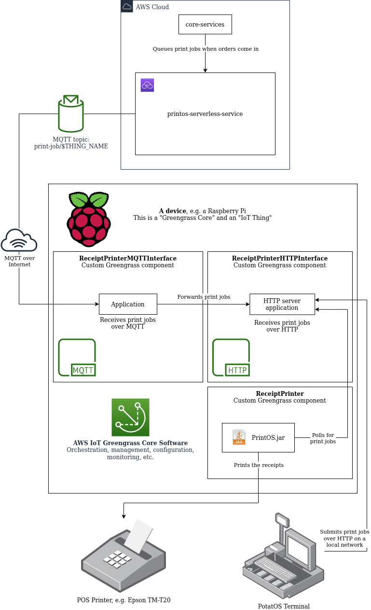

# PrintOS Receipt Printer Device Software

This repo contains

 - the software that runs on PrintOS devices, and
 - the config files and script used to set up the AWS Greengrass service for managing the devices.

A PrintOS device is a computer, usually a Raspberry Pi, running at a vendor's store, connected to
the internet and to a receipt printer. It can also be connected to local PotatOS point-of-sale
devices.

It receives print jobs from the POS devices when patrons place orders in person and from the
internet when patrons place orders online.

See <https://jira.agiledigital.com.au/browse/QFXFB-888> for more details.

Based on <https://github.com/DataPOS-Labs/print-provision>. Runs in [AWS
Greengrass](https://docs.aws.amazon.com/greengrass/v2/developerguide/what-is-iot-greengrass.html).

 - todo explain what a greengrass component is and other basic info
 - todo document how greengrass handles health checking
 - todo document how to manage the devices using greengrass

# Component Diagram



### Remote Printing Process

 1. A patron places an order through one of the patron apps.
 1. [core-services](https://stash.agiledigital.com.au/projects/QFX/repos/merivale/browse/server)
    creates a print job with
    [printos-serverless-service](https://github.com/DataPOS-Labs/printos-serverless-service) to
    print the order receipt on the vendor's printer.
 1. printos-serverless-service sends the print job to the vendor's Raspberry Pi over MQTT.
 1. The MQTT message triggers the ReceiptPrinterMQTTInterface Lambda, which runs on the Raspberry
    Pi. It just passes the print job along to ReceiptPrinterHTTPInterface.
 1. ReceiptPrinter polls ReceiptPrinterHTTPInterface and receives the print job. It formats the
    receipt and prints it. Then it tells ReceiptPrinterHTTPInterface that the job is complete, which
    tells printos-serverless-service and so on.

We use MQTT to send the remote print jobs mainly because it's the protocol with the best support in
AWS IoT. The main difference between it and HTTP is that MQTT uses a pub/sub model.

### Local Network Printing Process

 1. A patron places an order in person and the vendor's staff enter it into PotatOS.
 1. PotatOS submits a print job for the receipt over the local network through the HTTP interface.
 1. ReceiptPrinter polls ReceiptPrinterHTTPInterface and receives the print job. It formats the
    receipt and prints it.

## Directory Structure

```
├── artifacts/
│   │ The software artifacts for the Greengrass components, one subdir per component. The contents
│   │ are deployed to the IoT devices (the Raspberry Pis).
│   ├── io.datapos.ReceiptPrinter/
│   │     Formats the print jobs and prints them.
│   ├── io.datapos.ReceiptPrinterHTTPInterface/
│   │     Receives print jobs through HTTP from the local network and from
│   │     ReceiptPrinterMQTTInterface.
│   └── io.datapos.ReceiptPrinterMQTTInterface/
│         Receives remote (internet) print jobs from AWS through MQTT.
├── component-artifact-policy.json
│     Used by deploy.sh when it creates the IAM policy that lets the devices get the artifacts from
│     S3.
├── components.drawio
│     A component diagram for the project.
├── components.png
│     A raster of components.drawio.
├── copy-to-pi.sh
│     Copies this dir to your test device (RPi) so you can deploy locally for testing.
├── deploy-local-on-pi.sh
│     Deploy locally for testing. Run this on your test device.
├── deploy.sh
│     Deploy remotely, i.e. through AWS. Use this for production deployments.
├── deployment.yaml
│     Used by deploy.sh. Specifies the components to be deployed, among other things.
└── recipes/
    │ The config and metadata for the Greengrass components.
    ├── io.datapos.ReceiptPrinterMQTTInterface.yaml
    ├── io.datapos.ReceiptPrinterHTTPInterface.yaml
    └── io.datapos.ReceiptPrinter.yaml
```

## Setting Up a Raspberry Pi

1. Write Raspberry Pi OS (previously known as Raspian) to the SD card. I used Raspberry Pi Imager
   v1.6.1 to write `2021-03-04-raspios-buster-armhf-lite.img`.
1. [Enable SSH](https://www.raspberrypi.org/documentation/remote-access/ssh/). (See item 3.)
   ```sh
   touch /path/to/mounted/sd/card/boot/ssh
   ```
1. [Set up WiFi](https://www.raspberrypi.org/documentation/configuration/wireless/headless.md) if
   needed.
1. You might want to change its mDNS hostname if there will be other Raspberry Pis on the network.
   I'm not sure whether that can be done before the first boot. By default, the hostname will be
   `raspberrypi.local`.
1. Unmount the SD card and boot the Raspberry Pi with it.
1. SSH into it. The default password is `raspberry`.
   ```sh
   ssh pi@raspberrypi.local
   ```
1. Run `passwd` to change the password for the `pi` user. TODO: Can we do this more securely by
   editing `/etc/shadow` before the initial boot?
1. On the Raspberry Pi, install the requirements for the AWS IoT Greengrass Core software.
   1. Install OpenJDK 11. For me, this installed version 11.0.11+9-1~deb10u1.
      ```sh
      sudo apt update
      sudo apt install --yes openjdk-11-jdk
      ```
   1. Install Node.js 12. For me, this installed version 12.22.1-1nodesource1.
      ```
      $ sudo su
      # curl -fsSL https://deb.nodesource.com/setup_12.x | bash -
      # apt-get install -y nodejs
      # exit
      ```
1. On the Raspberry Pi, install the requirements for the AWS IoT Device JS SDK v2. For me, this
   installed CMake 3.16.3-3~bpo10+1 and libssl-dev 1.1.1d-0+deb10u6+rpt1.
   ```sh
   sudo apt install --yes cmake libssl-dev
   ```
1. Follow [Install the AWS IoT Greengrass Core
   software](https://docs.aws.amazon.com/greengrass/v2/developerguide/install-greengrass-core-v2.html)
   to install the Greengrass Core software on the Raspberry Pi. For me, this installed version
   2.1.0.
    - Make a note of the command and options you use when you run `Greengrass.jar`. It's probably
      worth saving the output, too.
    - Use `--setup-system-service true` so Greengrass will start on boot. The installer will create
      a systemd service for it.
    - Use the `ap-southeast-2` region.
    - Install to the default location, `/greengrass/v2`.
    - Either use `--tes-role-name ReceiptPrinterGreengrassV2TokenExchangeRole` or edit the
      `device_role` global in `deploy.sh`.
    - For example:
      ```sh
      sudo -E java -Droot="/greengrass/v2" -Dlog.store=FILE \
        -jar ./greengrass-nucleus-latest/lib/Greengrass.jar \
        --aws-region ap-southeast-2 \
        --thing-name ReceiptPrinterPi \
        --thing-group-name ReceiptPrinterGroup \
        --tes-role-name ReceiptPrinterGreengrassV2TokenExchangeRole \
        --tes-role-alias-name ReceiptPrinterGreengrassCoreTokenExchangeRoleAlias \
        --component-default-user ggc_user:ggc_group \
        --provision true \
        --deploy-dev-tools true \
        --setup-system-service true
      ```
1. Add the Raspberry Pi as a device in your printos-serverless-service instance.
   1. In DynamoDB, find the `printClientsTable-[stage]` table.
   1. Add a new item with the Raspberry Pi's Thing Name as the `destination`. Make a note of the
      `password` you choose as you will need it when you deploy this project to the Pi. If you have
      multiple devices in the same Thing Group, they currently all need to use the same password.
1. Follow [Raspberry Pi Deployment Wifi Connection Lost
   Issue](https://github.com/DataPOS-Labs/print-provision#raspberry-pi-deployment-wifi-connection-lost-issue)
   to configure the Pi to reboot if its internet connection drops out.
    - TODO: This will make internet drop-outs interrupt local printing. It should at least try
      restarting the network interface first. See
      [QFXFB-902](https://jira.agiledigital.com.au/browse/QFXFB-902).
1. Deploy the PrintOS software to the Raspberry Pi by following the Deploying section below.

If you need to install a driver for an Epson TM-T20 printer, see
<https://github.com/DataPOS-Labs/print-provision#raspberry-pi-deps>.

## Deploying

### For Development

1. Run `nvm use` in the root dir to switch to the project's Node.js version.
1. Run `npm install` in `health-reporting/`, `artifacts/io.datapos.ReceiptPrinterMQTTInterface/` and
   `artifacts/io.datapos.ReceiptPrinterHTTPInterface/`.
1. If you've deployed any of the components through AWS (i.e. not locally), you'll need to remove
   them from the device before deploying different versions of them locally.
   ```sh
   sudo /greengrass/v2/bin/greengrass-cli deployment create \
      --remove io.datapos.ReceiptPrinter --groupId thinggroup/ReceiptPrinterGroup
   ```
   Then check `sudo /greengrass/v2/bin/greengrass-cli component list` until it's removed from the
   list. The docs say you can give multiple component names with `--remove`, but I've found that
   causes the command to have no effect, at least when also using `--groupId`.
1. Edit the recipes in the `recipes/` dir and change the configuration variables for the components
   as needed. You'll probably need to change most of them. There are some comments in the recipes
   that explain how.
1. Copy the project directory to your Raspberry Pi by running `copy-to-pi.sh` (or some other way).
   `copy-to-pi.sh` assumes its hostname will be `raspberrypi.local`, so you'll need to edit it if
   you've changed that.
1. If you haven't already done so on this Pi, or you've changed the dependencies in
   `health-reporting`, run `npm ci` in `health-reporting/` on the Pi. This will compile
   the AWS packages that have native code. It takes about 15 minutes, but you should only need to do
   it occasionally. That said, it's probably worth making a backup copy of
   `health-reporting/node_modules/` in case you accidentally delete it.
1. Run `deploy-local-on-pi.sh` from the project directory on the device.

### For Production

1. Checkout the tag for the version you want to deploy, which is probably the most recent release
   tag. See the Releasing section below if you want to deploy a version that hasn't been released
   yet.
1. Run `nvm use` in the root dir to switch to the project's Node.js version.
1. Run `npm ci` in `artifacts/io.datapos.ReceiptPrinterMQTTInterface/` and
   `artifacts/io.datapos.ReceiptPrinterHTTPInterface/`.
1. Build the native binaries for the AWS packages that have native code.
   
   If you want to deploy to devices with different architectures, you'll need a separate deployment
   for each. You might be able to follow these steps once for each architecture and then combine the
   `health-reporting/node_modules/aws-crt/dist/bin/` dirs, but I haven't tried it. And I don't know
   how you'd combine the `sha256_profile` files.
   1. Copy the project to one of the devices you're going to deploy to.
   1. Run `npm ci` in `health-reporting/` on that device. This will compile the AWS packages that
      have native code. It takes about 15 minutes.
   1. Copy `health-reporting/node_modules/` from the device to your PC. For example,
      ```sh
      rm -rf print-provision-greengrass/health-reporting/node_modules
      rsync --info=progress2 --archive \
          pi@raspberrypi.local:/home/pi/print-provision-greengrass/health-reporting/node_modules \
          print-provision-greengrass/health-reporting/
      ```
1. Edit `deployment.yaml`:
   1. Change the `targetArn` field to the ARN of your AWS IoT Thing Group. You can find it at
      <https://console.aws.amazon.com/iot/home#/thingGroupHub>.
   1. Change the configuration variables for the components as needed. You'll probably need to
      change most of them. There are some comments in the file that explain how.
1. If you haven't already, configure the AWS CLI to use the correct account/user.
   ```sh
   aws configure
   ```
   You can check first with `aws sts get-caller-identity`.
1. Choose an S3 bucket to store the components' artifacts and run `deploy.sh [S3 bucket name]`. If
   the bucket doesn't already exist, `deploy.sh` will create it. Note that S3 bucket names must be
   globally unique.

   `deploy.sh` will then:
   1. If it hasn't already been created, create and attach an IAM policy that allows the devices to
      read the files in the S3 bucket.
   1. Upload the software artifacts into the S3 bucket so the devices can download and run them.
   1. In the AWS Greengrass service, create
      - the current version of each component, and
      - a deployment that deploys those versions to the devices.
1. Consider committing your `deployment.yaml` to the `main` branch, for example, as
   `deployment-brodburger.yaml`.

### Checking Your Deployment

It can take a while for the deployment to roll out to your device and start running, even for a
local deployment. You can check its progress in the AWS Console or on your device.

To check the progress on a particular device, you can watch the logs from the deployment by running
this on the device:

```sh
sudo tail --follow=name /greengrass/v2/logs/greengrass.log
```

Or you can run (from any machine) `aws greengrassv2 list-installed-components
--core-device-thing-name [thing name]` to see the version numbers of the components currently
deployed to it. The thing name will be "ReceiptPrinterPi" if you followed the example above. Or run
`sudo /greengrass/v2/bin/greengrass-cli component list` on the device itself to get a list with more
useful details.

## Releasing

1. Following semver, bump the version numbers of every component, even if they haven't been changed
   since their last release. The release and deploy processes are a bit easier if we keep the
   version numbers in sync and so far we don't have a good reason not to.
   1. Change the version numbers in the `recipes/` files. You may need to change it in multiple
      places in some of them, e.g. in the S3 URLs.
   1. Change the version numbers in `deploy.sh` and `deploy-local-to-pi.sh`.
   1. Change the version numbers in `deployment.yaml`.
1. Commit to `main`.
1. Tag your commit with the new version number.

## Troubleshooting

Greengrass writes logs to the directory `/greengrass/v2/logs` on the device, including logs from the
components. You can watch the most relevant logs with

```sh
sudo tail --follow=name /greengrass/v2/logs/io.datapos.ReceiptPrinterHTTPInterface.log \
   --follow=name /greengrass/v2/logs/io.datapos.ReceiptPrinterMQTTInterface.log \
   --follow=name /greengrass/v2/logs/io.datapos.ReceiptPrinter.log \
   --follow=name /greengrass/v2/logs/greengrass.log
```

You can check on the Greengrass Core software with

```
systemctl status greengrass
```

## Testing

For testing, you can configure the ReceiptPrinter component to print to PDF. However, the PDF will
always be blank, so you still need a real receipt printer to test the output.

1. The `printer` configuration variable in
   [io.datapos.ReceiptPrinter.yaml](recipes/io.datapos.ReceiptPrinter.yaml) needs to be set to
   `PDF`, which it is by default.
1. Install the print-to-PDF driver on your test device: `sudo apt install cups cups-bsd
   printer-driver-cups-pdf`
1. In `/etc/cups/cups-pdf.conf` on your device, comment out the line `Out ${HOME}/PDF`. That
   configures the driver to write the PDFs to `/var/spool/cups-pdf/ggc_user` (`ggc_user` is the
   user the component runs as), which avoids permissions issues.
1. Restart CUPS: `sudo systemctl restart cups`

### Submitting a Test Job

In this example, `https://3qpbp0efwe.execute-api.ap-southeast-2.amazonaws.com/dev/submit` is the
`/submit` endpoint of your
[printos-serverless-service](https://github.com/DataPOS-Labs/printos-serverless-service) deployment,
`blueberry` is the password in its DynamoDB and `ReceiptPrinterPi` is the AWS IoT Thing Name of your
test device (i.e. your Raspberry Pi).

```sh
curl https://3qpbp0efwe.execute-api.ap-southeast-2.amazonaws.com/dev/submit --data 'destination=Rec\
eiptPrinterPi&password=blueberry&data=%7B%22mode%22%3A%22tagged%22%2C%22comments%22%3A%22%3Ccenter%\
3E+Powered+by+DataPOS+%3C%2Fcenter%3E+%3Ccenter%3E+Powered+by+DataPOS+%3C%2Fcenter%3E+%3Ccenter%3E+\
%3Ch3%3ETime+Ordered%3A%3C%2Fh3%3E+%3C%2Fcenter%3E+%3Ccenter%3E+%3Ch3%3E+2%2F05%2F21+2%3A23+PM+%3C%\
2Fh3%3E+%3C%2Fcenter%3E+%3Cleft%3EService+Mode%3A+TakeAway%3C%2Fleft%3E+++++%3Cleft%3E+%3Ch3%3E1+Br\
azilian+Rooster%7E%3C%2Fh3%3E+%3C%2Fleft%3E+++++%3Cleft%3E+%3Ch3%3E2+Japanese+Rooster%7E%3C%2Fh3%3E\
+%3C%2Fleft%3E+++++%3Cleft%3E+%3Ch3%3E1+Little+Rooster%7E%3C%2Fh3%3E+%3C%2Fleft%3E+++++%3Cleft%3E+%\
3Ch3%3E1+Manly+Rooster%7E%3C%2Fh3%3E+%3C%2Fleft%3E++++++%3Ccenter%3E%3Ch3%3E%2B+Pineapple%3C%2Fh3%3\
E%3C%2Fcenter%3E++++++%3Ccenter%3E%3Ch3%3E%2B+Bacon%3C%2Fh3%3E%3C%2Fcenter%3E+++++++++%3Cleft%3E+%3\
Ch3%3E3+Hot+Chips%3C%2Fh3%3E+%3C%2Fleft%3E++++++%3Ccenter%3E%3Ch3%3EChicken+Salt%3C%2Fh3%3E%3C%2Fce\
nter%3E+++++%3Cleft%3E+%3Ch3%3E2+Hot+Chips%3C%2Fh3%3E+%3C%2Fleft%3E++++++%3Ccenter%3E%3Ch3%3ERegula\
r+Salt%3C%2Fh3%3E%3C%2Fcenter%3E++++%3Ccenter%3E+%3Ch4%3EOrder+and+Collect%3C%2Fh4%3E+%3C%2Fcenter%\
3E+%3Ccenter%3E+%3Ch5%3EOrder+NO.+Y14%3C%2Fh5%3E+%3C%2Fcenter%3E++++%3Cleft%3EPhone%3A+%2B614001210\
94%3C%2Fleft%3E+++++%3Cleft%3EName%3A+Sharon+Newman%3C%2Fleft%3E++++%3Ccenter%3E+Powered+by+DataPOS\
+%3C%2Fcenter%3E+%22%7D'
```
